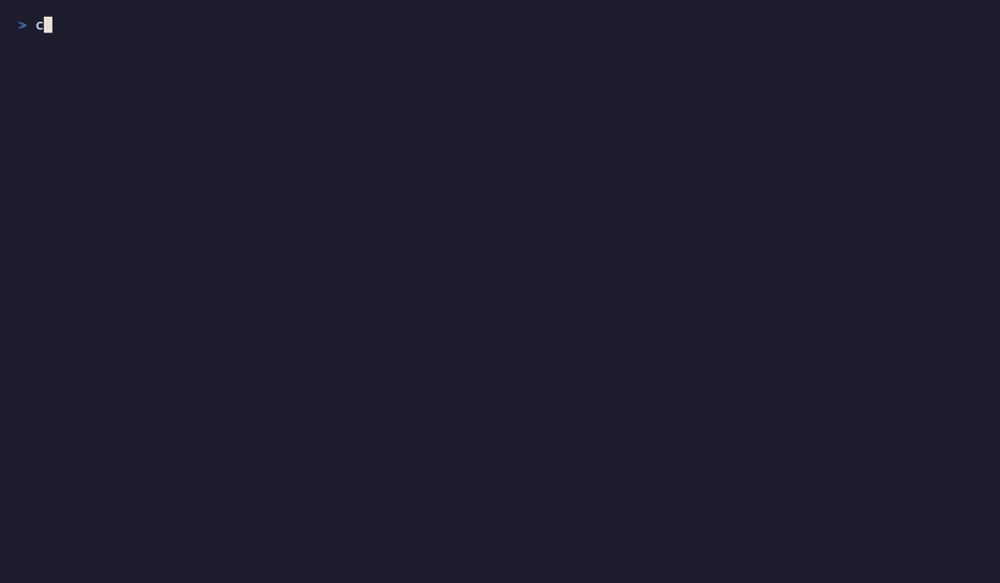
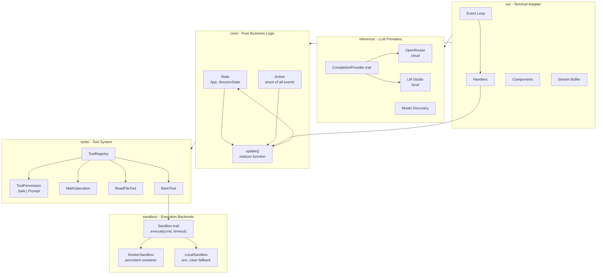
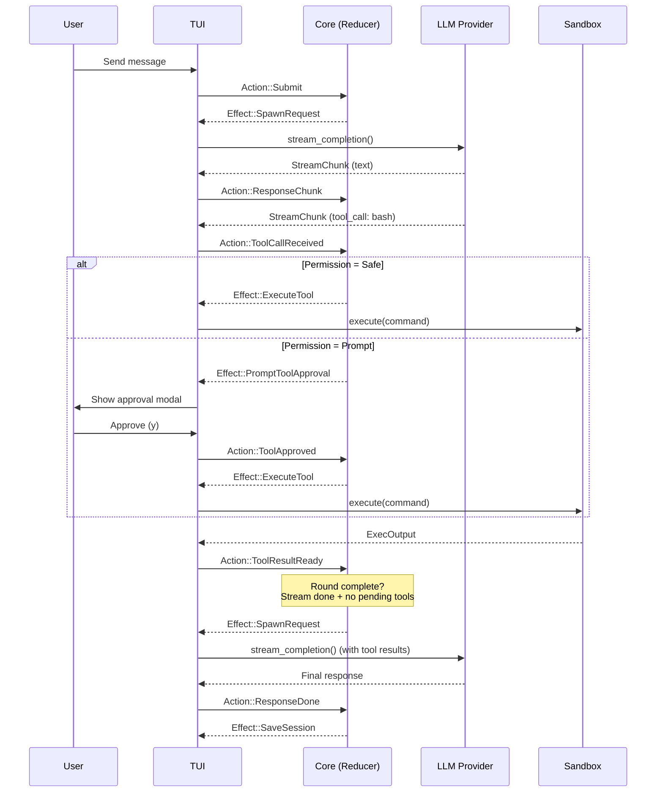
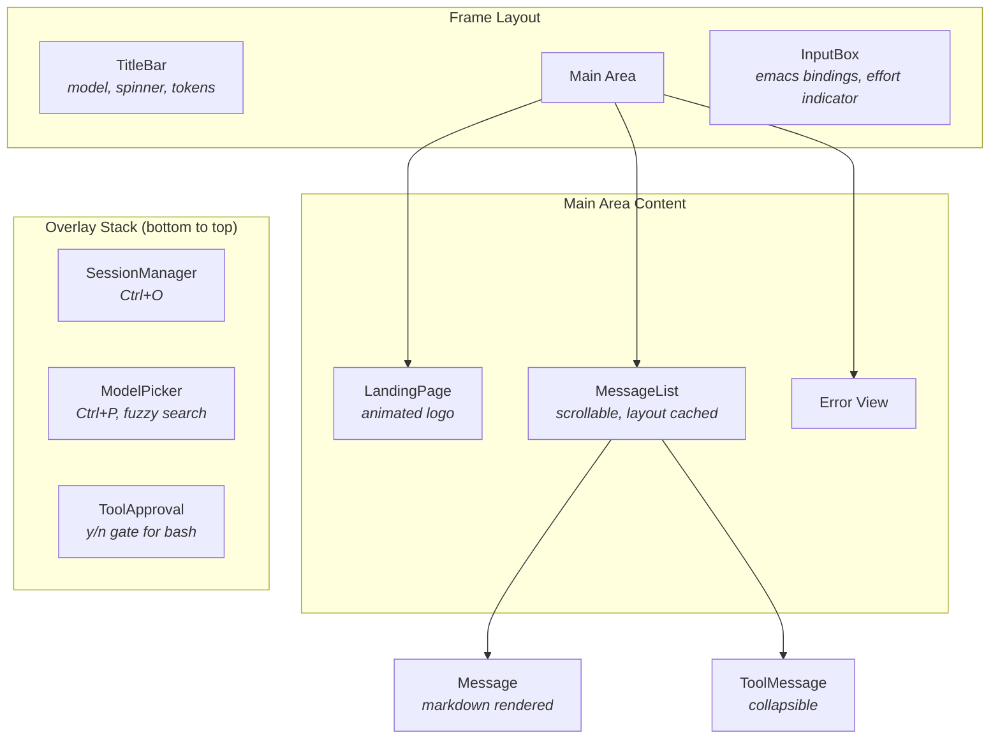

# Navi

A model-agnostic agent harness built in Rust. Context, memory, and personality live on your machine - not in a megacorp's cloud.

I use tools like Claude Code and OpenCode daily and wanted to understand how they actually work. Navi is the result: building my own agent harness from scratch to pull apart the ideas - context engineering, tool orchestration, persistent memory - and try my own out. No black boxes.

Named after Navi from Ocarina of Time.

## Demos

### Startup & Model Switching

Session manager on startup, model picker with live search, switch providers on the fly.


### Markdown Conversation

Full markdown rendering: syntax-highlighted code blocks, tables, lists, blockquotes.


### Agentic Tool Use

Chained tool calls with collapsible result blocks. The model calls add -> multiply -> divide to solve `((3+3) * 5) / 2`.


### Emacs-Style Editing

Kill/yank, word deletion, home/end, and input history recall.


### Modes & Reasoning Effort

Cycle reasoning effort (Auto -> Low -> Medium -> High), then navigate messages in cursor mode.



## Why

Navi exists for three reasons:

1. **A ground-up agent harness.** Building the scaffolding around LLMs from scratch - context management, tool execution, memory systems - to understand how tools like Claude Code and OpenCode work under the hood.

2. **A local-first platform.** Data stays on your machine, not in a megacorp's cloud.

3. **An experimentation testbed.** A place to try ideas out: agentic tool use, persistent memory, knowledge graphs, and see what actually works.

## Quick Start

```bash
# Clone and build
git clone <repo-url> && cd navi
cargo run
```

On first run, Navi generates `~/.navi/config.toml` with commented defaults. Edit it to add your API key and preferred model.

### Docker (Recommended)

If Docker is available, Navi runs all shell commands inside a sandboxed container. No extra setup required - Navi detects Docker automatically and falls back to local execution if it's not found.

```bash
# Verify Docker is available (optional)
docker info
```

## Features

- **Multi-provider support** - OpenRouter (cloud) and LM Studio (local), switchable at runtime
- **Agentic tool loop** - up to 20 rounds of chained tool calls with parallel dispatch
- **Shell execution** - bash tool with Docker sandboxing and user approval gate
- **Tool permission system** - safe tools auto-execute, dangerous tools prompt for approval
- **Streaming responses** - SSE streaming with smoothing buffer for even chunk delivery
- **Full markdown rendering** - syntax-highlighted code blocks, tables, lists, blockquotes, task lists
- **Emacs-style editing** - word navigation, kill/yank buffer, line kills, word deletion
- **Input history** - Up/Down recalls previous messages, preserves unsent draft
- **Session management** - persistent sessions with rename, delete, sequential numbering
- **Model picker** - live search across pinned and fetched models, switch without restarting
- **Reasoning effort** - cycle through Auto/Low/Medium/High/Off per message
- **Cursor mode** - keyboard navigation through the conversation, expand/collapse tool calls
- **Bracketed paste** - paste multi-line text with preserved newlines

## Architecture

### High-Level Design

Elm-style architecture with strict layer separation. Core is pure business logic - no I/O, no UI. The TUI is one possible adapter; the same core could drive a web UI or CLI.



### Agentic Tool Loop

When the model requests a tool call, Navi checks the tool's permission level. Safe tools execute immediately; prompt-level tools show an approval modal. Results feed back into the context for the next round.



### Docker Sandbox Lifecycle

The Docker container is created lazily on the first bash command and reused for all subsequent commands. State persists across commands within a session (files created in one command are visible in the next). The container is stopped and removed when Navi exits.

```mermaid
stateDiagram-v2
    [*] --> Idle: DockerSandbox::new()

    Idle --> Creating: First execute() call
    Creating --> Running: docker run -d --rm
    Running --> Running: docker exec (per command)
    Running --> Stopped: Drop / exit

    state Running {
        [*] --> Ready
        Ready --> Executing: execute(cmd)
        Executing --> Ready: ExecOutput
        Executing --> TimedOut: timeout exceeded
        TimedOut --> Ready: docker stop
    }
```

### TUI Component Architecture

Components follow two patterns: stateless (receive props, render) and stateful (manage local state, emit events). Overlays stack with tool approval on top.



## Configuration

Config lives at `~/.navi/config.toml`. Environment variables and CLI flags override it.

```toml
[general]
default_provider = "openrouter"
default_model = "anthropic/claude-sonnet-4"
max_agentic_rounds = 20
max_output_tokens = 16384
reasoning_effort = "auto"           # auto | low | medium | high | none
# system_prompt = "..."             # inline system prompt
# system_prompt_file = "prompt.md"  # or load from ~/.navi/prompt.md

[openrouter]
api_key = "your-key-here"
# base_url = "https://openrouter.ai/api/v1"

[lmstudio]
# base_url = "http://localhost:1234/v1"

# Pin models to the top of the model picker
[[models]]
name = "anthropic/claude-sonnet-4"
provider = "openrouter"
description = "Fast and capable"

[[models]]
name = "qwen3-8b"
provider = "lmstudio"
description = "Local 8B model"
```

### Environment Variables

| Variable | Overrides |
|----------|-----------|
| `OPENROUTER_API_KEY` | `openrouter.api_key` |
| `OPENROUTER_BASE_URL` | `openrouter.base_url` |
| `LM_STUDIO_BASE_URL` | `lmstudio.base_url` |
| `PRIMARY_MODEL_NAME` | `general.default_model` |
| `NAVI_PROVIDER` | `general.default_provider` |

### CLI Flags

```bash
cargo run                          # OpenRouter (default)
cargo run -- --provider lmstudio   # LM Studio (local)
cargo run -- -p lmstudio           # Short form
```

### Providers

| Provider | Description | Auth |
|----------|-------------|------|
| **OpenRouter** | Cloud gateway to many models ([openrouter.ai](https://openrouter.ai/)) | `OPENROUTER_API_KEY` |
| **LM Studio** | Local inference server (v0.3.29+) | None (local) |

Both providers use the Responses API with SSE streaming.

## Tools

Navi's tool system uses a trait-based design with automatic JSON Schema generation via `schemars`. Each tool declares its permission level.

| Tool | Permission | Description |
|------|-----------|-------------|
| `math_operation` | Safe | Arithmetic operations (add, subtract, multiply, divide, power) |
| `read_file` | Safe | Read file contents as UTF-8 text |
| `bash` | Prompt | Execute shell commands in a sandboxed environment |

**Safe** tools execute immediately when the model requests them. **Prompt** tools show an approval modal displaying the tool name and arguments - press `y` to approve, `n` or `Esc` to deny. Denied tools return an error to the model so it can adapt.

Unknown tools (not in the registry) default to Prompt permission for safety.

### Sandbox Backends

The `bash` tool delegates execution to a `Sandbox` backend, selected automatically at startup:

| Backend | When | Isolation | Performance |
|---------|------|-----------|-------------|
| **DockerSandbox** | Docker CLI available | Full: clean env, separate filesystem, namespaced PIDs | ~600ms first call (container creation), ~180ms subsequent |
| **LocalSandbox** | Docker not available | Minimal: `env_clear()` with safe var whitelist (PATH, HOME, TERM, LANG, USER, SHELL) | <10ms |

DockerSandbox creates a persistent `ubuntu:24.04` container on the first bash command, volume-mounts CWD as `/workspace`, and reuses it for all subsequent commands. The container is stopped and removed on exit.

## Controls

Navi uses a modal input system: **Input mode** (default) for typing, and **Cursor mode** for navigating messages. Overlays (session manager, model picker, tool approval) float above both.

### Input Mode

| Key | Action |
|-----|--------|
| `Enter` | Send message |
| `Shift+Enter` / `Ctrl+J` | Insert newline |
| `Esc` | Cancel generation (if loading), otherwise enter Cursor mode |
| `Ctrl+C` | Quit |
| `<-` `->` | Move cursor |
| `Up` `Down` | Move cursor; at input boundary, navigate input history |
| `Home` / `End` | Jump to start/end of line |
| `Ctrl+A` / `Ctrl+E` | Start/end of line (Emacs) |
| `Alt+<-` / `Alt+->` | Move by word |
| `Backspace` / `Delete` | Delete character |
| `Ctrl+W` / `Alt+Backspace` | Delete word backward |
| `Alt+D` | Delete word forward |
| `Ctrl+U` | Kill to line start |
| `Ctrl+K` | Kill to line end |
| `Ctrl+Y` | Yank (paste from kill buffer) |
| `Ctrl+R` | Cycle reasoning effort |
| `Ctrl+P` | Open model picker |
| `Ctrl+O` | Open session manager |

### Cursor Mode

| Key | Action |
|-----|--------|
| `Up` / `Down` | Navigate messages |
| `Space` | Expand/collapse tool call block |
| `Enter` or any character | Switch back to Input mode |
| `Esc` | Cancel generation (if loading) |
| `Ctrl+C` | Quit |

### Tool Approval Modal

| Key | Action |
|-----|--------|
| `y` | Approve - execute the tool |
| `n` / `Esc` | Deny - return error to model |

### Session Manager (`Ctrl+O`)

| Key | Action |
|-----|--------|
| `Up` / `Down` | Move selection |
| `Enter` | Load session |
| `n` | New session |
| `r` | Rename selected session (inline edit) |
| `d` `d` | Delete session (press twice to confirm) |
| `Esc` | Dismiss |

### Model Picker (`Ctrl+P`)

| Key | Action |
|-----|--------|
| Type to search | Live filter by name, provider, or description |
| `Up` / `Down` | Move selection |
| `Enter` | Switch to selected model |
| `Backspace` | Clear search character |
| `Esc` | Clear search (first), dismiss (second) |

### Always Active

| Key | Action |
|-----|--------|
| `Page Up` / `Page Down` | Scroll messages |
| `Mouse wheel` | Scroll messages |
| Mouse click | Select message; toggle tool call expand/collapse |

Bracketed paste is supported - paste multi-line text and newlines are preserved.

## Project Structure

```
src/
├── main.rs                       # Entry point, CLI args, logger setup
├── lib.rs                        # Library root, Provider enum
├── test_support.rs               # Shared test utilities (NoopProvider, test_app)
├── core/                         # Pure business logic (no I/O)
│   ├── mod.rs                    # Module declarations
│   ├── state.rs                  # App, SessionState, ActiveModel
│   ├── action.rs                 # Action enum + update() reducer + Effect enum
│   ├── config.rs                 # Config loading (TOML + env + CLI)
│   ├── session.rs                # Session persistence (JSON files)
│   ├── tools/                    # Tool system
│   │   ├── mod.rs                # Tool trait, DynTool, ToolRegistry
│   │   ├── permission.rs         # ToolPermission enum (Safe | Prompt)
│   │   ├── math.rs               # MathOperation (add, subtract, multiply, divide, power)
│   │   ├── io.rs                 # ReadFileTool
│   │   └── bash.rs               # BashTool (delegates to Sandbox)
│   └── sandbox/                  # Execution sandboxing
│       ├── mod.rs                # Sandbox trait, ExecOutput, ExecError
│       ├── docker.rs             # DockerSandbox (persistent container)
│       └── local.rs              # LocalSandbox (env_clear fallback)
├── inference/                    # LLM provider integrations
│   ├── mod.rs                    # Re-exports, build_provider()
│   ├── types.rs                  # Context, Source, Effort, UsageStats, StreamChunk
│   ├── provider.rs               # CompletionProvider trait
│   ├── model_discovery.rs        # Fetch available models from provider APIs
│   └── providers/
│       ├── mod.rs                # Provider module declarations
│       ├── openrouter.rs         # OpenRouter streaming client
│       └── lmstudio.rs           # LM Studio streaming client
└── tui/                          # Terminal UI (Ratatui)
    ├── mod.rs                    # Event loop, terminal setup, TuiState
    ├── event.rs                  # Input event mapping (crossterm -> TuiEvent)
    ├── handlers.rs               # Event dispatch, effect processing
    ├── tasks.rs                  # Async task spawning (requests, tools, model fetch)
    ├── ui.rs                     # Top-level rendering, hit testing
    ├── markdown.rs               # Markdown -> styled spans (pulldown_cmark + syntect)
    ├── stream_buffer.rs          # Stream smoothing for even chunk delivery
    ├── component.rs              # Component + EventHandler traits
    └── components/
        ├── mod.rs                # Component re-exports
        ├── title_bar.rs          # Status bar (spinner, model, tokens)
        ├── message.rs            # Single message widget (markdown rendered)
        ├── message_list.rs       # Scrollable conversation view (layout cached)
        ├── tool_message.rs       # Collapsible tool call/result blocks
        ├── tool_approval.rs      # Tool approval modal (y/n gate)
        ├── landing.rs            # Landing page (animated logo)
        ├── logo.rs               # Braille art logo
        ├── session_manager.rs    # Session list overlay
        ├── model_picker.rs       # Model search/select overlay
        └── input_box/
            ├── mod.rs            # Text input with emacs bindings
            ├── cursor.rs         # Cursor position and scroll state
            └── text_wrap.rs      # Text wrapping and word boundary utilities
```

## Development

```bash
cargo build          # Build
cargo run            # Run
cargo test           # Test (317 tests)
cargo clippy         # Lint
cargo fmt            # Format
```

Rust 2024 edition. Logs are written to `navi.log` in the current directory.

### Recording Demos

Demo tapes use [VHS](https://github.com/charmbracelet/vhs) for terminal recording:

```bash
vhs demos/start.tape          # Startup & model switching
vhs demos/conversation.tape   # Markdown conversation
vhs demos/tools.tape          # Agentic tool use
vhs demos/editing.tape        # Emacs-style editing
vhs demos/modes.tape          # Modes & reasoning effort
```

## License

MIT
